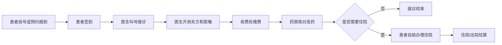

# 医院管理系统 7.0

一个基于 C/C++ 和 Visual Studio 的医院信息管理系统课程设计项目，围绕门诊挂号、预约报到、医生接诊、缴费结算、药房发药、住院管理、医保报销、管理员统计等场景，模拟完整的医院业务流转。

> 工程文件名仍沿用“医疗管理系统6.0”，但源码中已经包含 7.0 功能字段，例如医保类型、药品类别、患者签到队列等。

## 项目亮点

| 模块 | 说明 |
| --- | --- |
| 患者自助终端 | 支持现场挂号、预约挂号、预约报到、患者签到、查看医嘱、打印发票、办理住院/出院 |
| 医生工作站 | 支持医生登录、待诊列表、签到叫号、患者病历查询、开具处方、录入检查费和医嘱、住院建议 |
| 收费与药房 | 支持费用结算、防逃费拦截、医保报销、处方核对、库存扣减、缺药退费、药品采购 |
| 住院管理 | 支持普通病房、VIP 病房、ICU 床位分配、住院费用、出院结算和床位释放 |
| 管理员后台 | 支持患者查询、科室统计、资金流动查询、医生管理、离职保留、病房占用格子图 |
| 数据持久化 | 使用 `his_data.dat` 保存医生、患者、药品、病房、预约和病历记录 |
| 演示数据 | 首次运行自动生成 130 位仿真患者，便于课堂演示和功能测试 |

## 技术栈

- 语言：C / C++，项目文件使用 `.cpp`
- IDE：Visual Studio
- 平台：Windows 控制台
- 构建标准：C++20
- 数据结构：链表、结构体、二进制文件持久化
- 交互方式：数字菜单 + 方向键高亮菜单

## 目录结构

```text
.
├── main.cpp                         # 系统入口、主菜单、时间推进、重置和保存
├── hospital_system.h                # 全局数据结构：医生、患者、药品、病房、预约、签到队列
├── hospital_functions.cpp           # 医生、药品、病房基础数据初始化
├── patient.cpp / patient.h          # 患者端：挂号、预约、签到、发票、住院入口
├── doctor.cpp / doctor.h            # 医生端：登录、接诊、开药、医嘱、改密
├── pharmacist.cpp                   # 收费处与药房：缴费、发药、库存、采购
├── inpatient.cpp / inpatient.h      # 住院与出院流程
├── admin.cpp                        # 管理员后台、统计查询、医生管理、病房看板
├── file_io.cpp / file_io.h          # 数据保存和加载
├── demo_data.cpp / demo_data.h      # 演示数据生成
├── utils.cpp / utils.h              # 控制台工具、模拟时间、医保计算等公共函数
├── his_data.dat                     # 当前演示数据存档
└── 医疗管理系统6.0.vcxproj          # Visual Studio 工程文件
```

## 运行环境

推荐使用 Windows + Visual Studio 打开运行。

1. 安装 Visual Studio，并勾选“使用 C++ 的桌面开发”。
2. 打开 `医疗管理系统6.0.slnx` 或 `医疗管理系统6.0.vcxproj`。
3. 选择 `Debug | x64` 或 `Release | x64`。
4. 点击“本地 Windows 调试器”运行。

也可以使用 Visual Studio Developer PowerShell 构建：

```powershell
msbuild .\医疗管理系统6.0.vcxproj /p:Configuration=Debug /p:Platform=x64
```

## 默认账号

| 角色 | 账号 | 密码 | 说明 |
| --- | --- | --- | --- |
| 医生 | `1001` - `1020` | `123` | 20 名预设医生，分布在 5 个科室 |
| 收费/药房管理员 | `admin` | `123` | 进入收费与药房管理终端 |
| 医院管理员 | `9` | `a` | 进入管理员后台 |

科室编号：

| 编号 | 科室 |
| --- | --- |
| 1 | 急诊科 |
| 2 | 内科 |
| 3 | 外科 |
| 4 | 儿科 |
| 5 | 妇科 |

## 主菜单说明

启动后进入主菜单：

```text
0. 退出系统
1. 患者
2. 医生
3. 药房/收费管理人员
4. 医院管理人员 (数据分析)
5. 推进时间一天
6. 重置/初始化系统数据
7. 手动保存数据
```

- 可以直接输入数字选择。
- 也可以使用方向键上下移动，按 Enter 确认。
- 系统使用模拟日期，默认从 `2026-03-09` 开始。
- 退出系统时会自动保存数据。

## 典型业务流程



## 患者端操作指南

进入主菜单选择 `1. 患者`。

| 功能 | 使用方法 |
| --- | --- |
| 门诊挂号 | 选择新患者注册或复查患者挂号，输入姓名、性别、生日、手机号、医保类型，选择科室和医生 |
| 预约挂号 | 使用患者 ID、手机号或新患者注册预约，选择科室、医生、未来 7 天日期和上午/下午时段 |
| 预约报到 | 预约当天使用，系统会按预约医生生成挂号单，并将患者激活为待诊状态 |
| 患者签到 | 非急诊患者挂号后需要签到，医生端按签到顺序叫号 |
| 查看医嘱 | 医生看诊后查看处方、住院要求、检查费、药费和当前缴费状态 |
| 打印电子发票 | 查看历史缴费发票和退费凭证 |
| 自助办理住院 | 医生开具住院建议并完成缴费后，选择普通病房或 VIP 病房办理入住 |
| 自助办理出院 | 结清住院费用后办理出院，系统释放床位 |
| 打印挂号单 | 通过患者 ID 或手机号查看综合信息和历史诊疗记录 |

挂号规则：

- 未满 18 岁患者只能挂急诊科或儿科。
- 成年患者不能挂儿科。
- 男性患者不能挂妇科。
- 急诊科不支持预约挂号。
- 已有未完成就诊流程时，不能重复挂号。

## 医生端操作指南

进入主菜单选择 `2. 医生`，输入医生工号和密码。

医生端主要功能：

| 功能 | 说明 |
| --- | --- |
| 开始看诊 | 急诊医生可按 ID/姓名查找患者；非急诊医生推荐按签到顺序叫号 |
| 查询全院患者 | 只读查看患者列表 |
| 修改个人密码 | 输入两次新密码并确认，修改成功后重新登录 |

看诊步骤：

1. 登录医生工作站。
2. 在待诊列表中确认患者签到状态。
3. 选择“开始看诊”。
4. 查看患者历史病历。
5. 输入处方药品，支持 `药名*数量`，也支持学名、商品名、别名匹配。
6. 输入检查费和附加诊疗费。
7. 判断是否需要住院；急诊医生可直接转入 ICU。
8. 输入医嘱说明，确认后患者进入待缴费状态。

## 收费与药房操作指南

进入主菜单选择 `3. 药房/收费管理人员`，使用默认账号 `admin / 123` 登录。

| 功能 | 说明 |
| --- | --- |
| 办理患者缴费 | 输入患者 ID，系统展示诊疗费、检查费、药费、床位费，并生成缴费发票 |
| 药房核对发药 | 仅允许已缴费患者取药；发药后扣减库存，处方标记为已发 |
| 查看药品库存 | 查看全院药品通用名、进价、售价、库存、适用科室和累计售出 |
| 药房采购进货 | 按药名补库存；未找到药品时可新建药品档案 |

费用与库存规则：

- 患者未缴清费用时，药房会拒绝发药。
- 药品库存不足时，系统会按实际发药数量扣库，并生成退费凭证。
- 新药可设置通用名、商品名、别名、进价、售价、库存、适用科室和药品类别。

## 管理员后台操作指南

进入主菜单选择 `4. 医院管理人员`，使用工号 `9`、密码 `a` 登录。

| 功能 | 说明 |
| --- | --- |
| 患者信息查询 | 支持查看全部患者、按 ID 查询、按姓名查询、按科室查询、按状态查询、导出患者信息 |
| 科室信息查询 | 查看各科室接诊人数、营收和在职医生 |
| 住院部入住管理 | 查看全部病房、手动办理出院、查看病房占用格子图 |
| 资金流动查询 | 查看诊疗、检查、药品、住院等收入统计，并支持导出 |
| 医生管理 | 查看在职医生、新增医生、开除医生、查看离职医生 |
| 医生排班看板 | 查看各医生当前待诊人数和排班情况 |

医生管理规则：

- 新增医生时需要填写姓名、科室、职级、挂号费和初始密码。
- 开除医生前会检查是否仍有待诊患者或未来预约。
- 离职医生不会物理删除，只会标记为离职，便于保留历史记录。

## 数据保存与重置

系统使用 `his_data.dat` 保存运行数据。

- 首次运行如果没有找到 `his_data.dat`，会自动初始化基础数据并生成演示患者。
- 主菜单选择 `7. 手动保存数据` 可立即保存。
- 退出系统时会自动保存。
- 主菜单选择 `6. 重置/初始化系统数据` 会清空患者、预约、病历记录，并重新生成演示数据。
- 如需恢复“首次运行”效果，可以删除 `his_data.dat` 后重新启动程序。

## 演示建议

课堂展示时可以按下面顺序演示：

1. 患者端注册新患者并现场挂号。
2. 患者完成签到。
3. 医生端登录并按签到顺序叫号。
4. 医生开具处方、检查费和医嘱。
5. 收费处办理缴费。
6. 药房核对发药并扣减库存。
7. 管理员查看患者状态、科室统计和资金流动。
8. 对需要住院的患者演示床位分配和出院流程。

## 说明

本项目用于课程设计和学习演示，重点展示链表数据管理、控制台交互、文件持久化和医院业务流程建模，不用于真实医疗场景。
